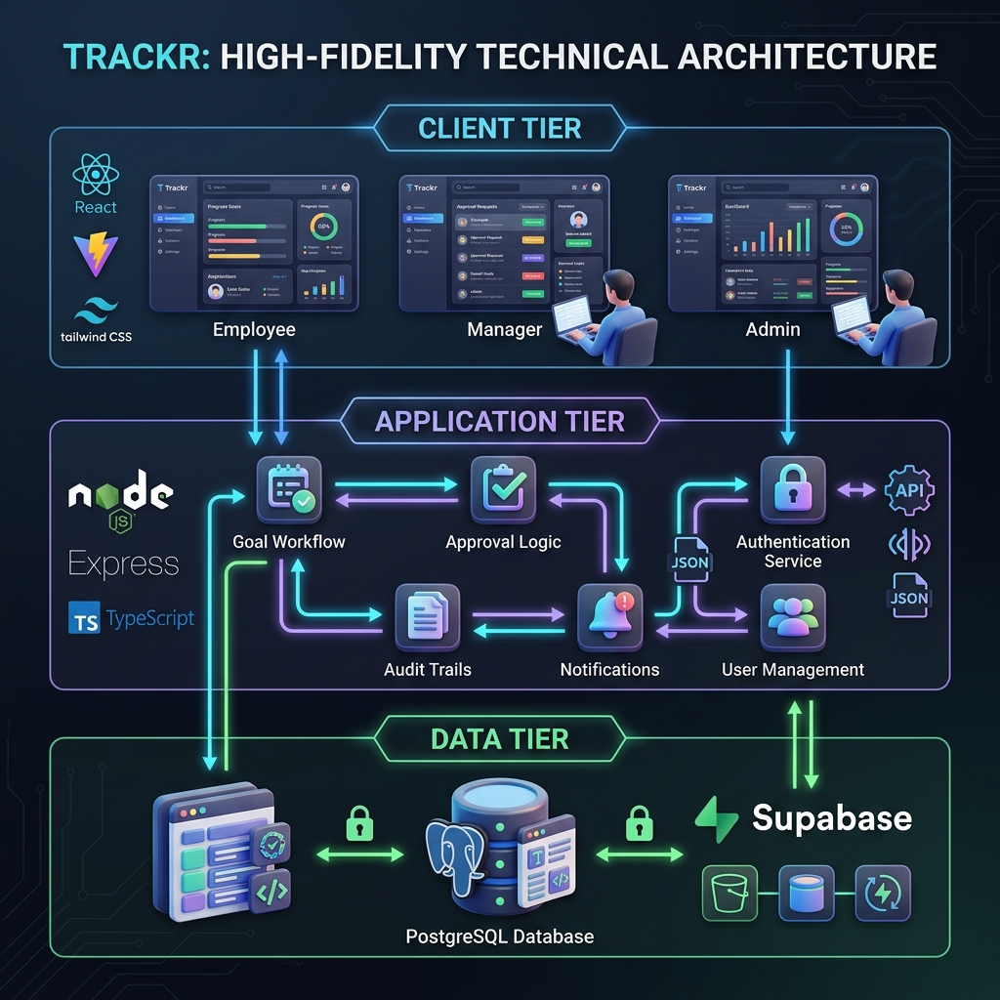

# Trackr - Goal Tracking Portal

<p align="center">
  
</p>

Trackr is a comprehensive **In-House Goal Setting & Tracking Portal** designed for enterprise environments. It digitizes the entire performance management lifecycle—from quarterly goal setting and manager approvals to progress tracking and audit-ready reporting.

---

## 🚀 Features

### 👤 Employee Portal
- **Goal Management**: Create and manage quarterly goals with strict weightage validation (total must equal 100%).
- **Draft & Submission**: Save goals as drafts and submit them for manager review during active windows.
- **Quarterly Check-ins**: Record progress for each goal using various Units of Measurement (numeric, boolean, timeline).
- **Automated Scoring**: Real-time achievement score calculation based on predefined targets.

### 👥 Manager Dashboard
- **Team Oversight**: View and manage goal sheets for all direct reports.
- **Approval Workflow**: Approve goal sheets or return them for rework with comments.
- **Shared Goals**: Propagate organizational or departmental goals to team members with automated progress synchronization.
- **Performance Tracking**: Monitor team check-ins and completion statuses at a glance.

### 🛡️ Admin & HR Control Panel
- **Cycle Management**: Configure goal-setting cycles and active submission windows.
- **Org Hierarchy**: Manage user roles (Employee, Manager, Admin) and reporting structures.
- **Audit Trails**: Complete transparency with detailed logging for every modification to locked goal sheets.
- **Analytics & Reporting**: Export comprehensive achievement and completion reports to CSV/Excel.

---

## 🏗️ Architecture

Trackr uses a modern, scalable **MERN + Supabase** architecture:

- **Frontend**: React 18 (Vite) + Tailwind CSS + TanStack Query.
- **Backend**: Node.js + Express + TypeScript + Zod validation.
- **Data**: Supabase (PostgreSQL 15) for persistence and authentication.



*For more details, see the [System Architecture Documentation](System_Architecture_Goal_Tracking_Portal.md).*

---

## 🛠️ Tech Stack

- **UI Framework**: [React 18](https://reactjs.org/)
- **Styling**: [Tailwind CSS](https://tailwindcss.com/)
- **State Management**: [TanStack Query v5](https://tanstack.com/query/latest)
- **API Runtime**: [Node.js](https://nodejs.org/) & [Express](https://expressjs.com/)
- **Language**: [TypeScript](https://www.typescriptlang.org/)
- **Database**: [PostgreSQL 15](https://www.postgresql.org/) (via [Supabase](https://supabase.com/))
- **Documentation**: [Swagger / OpenAPI](https://swagger.io/)

---

## 🏁 Getting Started

### Prerequisites
- Node.js (v18+)
- npm or yarn
- A Supabase account

### Installation

1. **Clone the repository**
   ```bash
   git clone https://github.com/YASH-DHADGE/Trackr---Goal-Tracking-Portal.git
   cd Trackr---Goal-Tracking-Portal
   ```

2. **Install dependencies**
   Use the root-level script to install all frontend and backend dependencies:
   ```bash
   npm run install-all
   ```

3. **Environment Setup**
   Create a `.env` file in the `/backend` directory:
   ```env
   PORT=3001
   DATABASE_URL=your_supabase_postgresql_connection_string
   JWT_SECRET=your_jwt_secret
   ```

4. **Database Migration**
   The backend automatically runs migrations on startup. Ensure your `DATABASE_URL` is correct.

5. **Run the application**
   From the root directory, run both frontend and backend concurrently:
   ```bash
   npm run dev
   ```
   - Frontend: `http://localhost:5173`
   - Backend: `http://localhost:3001`
   - API Docs: `http://localhost:3001/api/docs`

---

## 📁 Project Structure

```text
├── backend
│   ├── src
│   │   ├── config        # DB connection & migrations
│   │   ├── middleware    # Auth & validation guards
│   │   ├── modules       # Domain-driven feature logic
│   │   └── routes        # Express API endpoints
│   └── supabase/migrations
├── frontend
│   ├── src
│   │   ├── api           # Axios client & Query hooks
│   │   ├── components    # Shared UI library
│   │   ├── features      # Feature-specific components
│   │   ├── layouts       # Role-based layout wrappers
│   │   └── pages         # Route-level views
│   └── public            # Static assets
└── docs                  # Architecture & design documentation
```

---

## 📄 License
This project is licensed under the ISC License.
